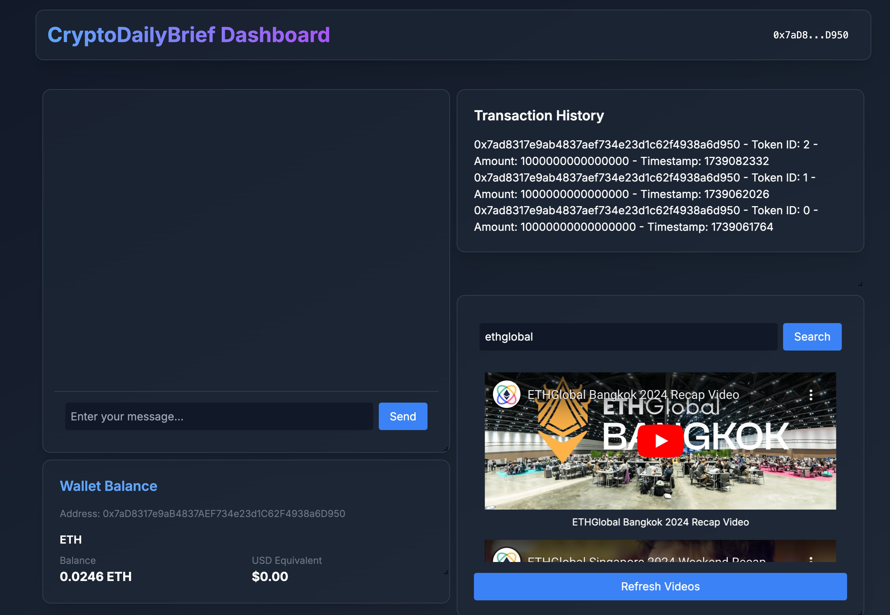
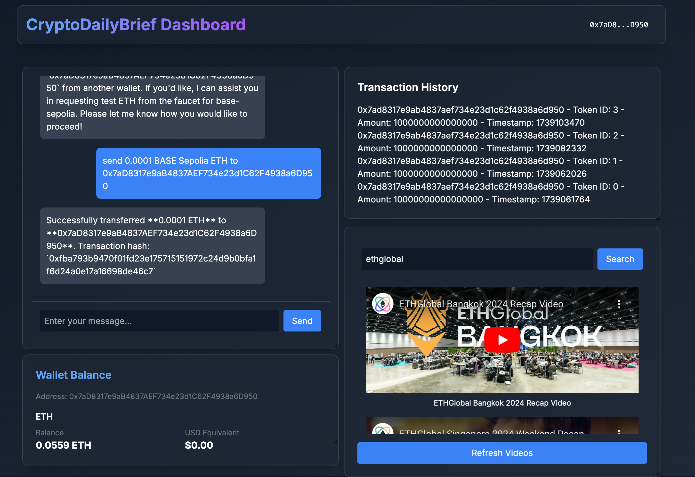
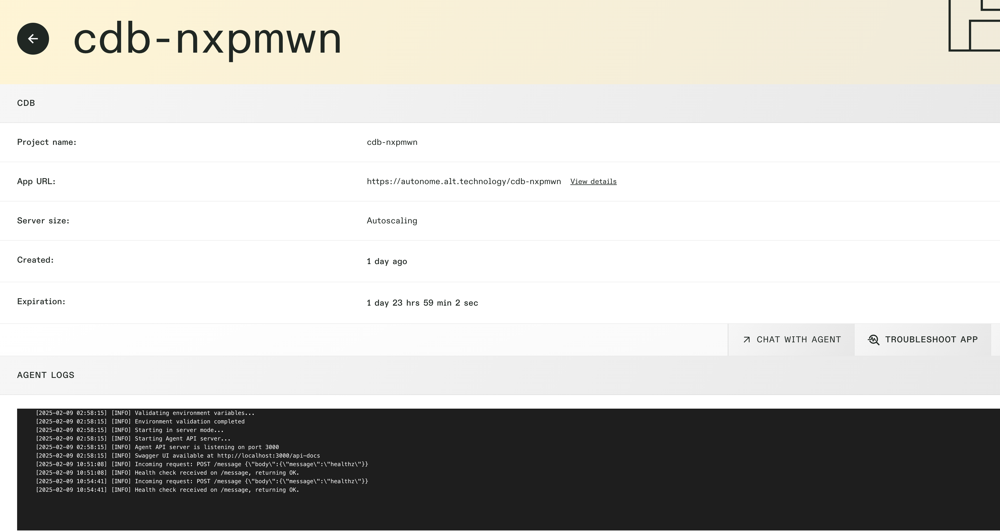
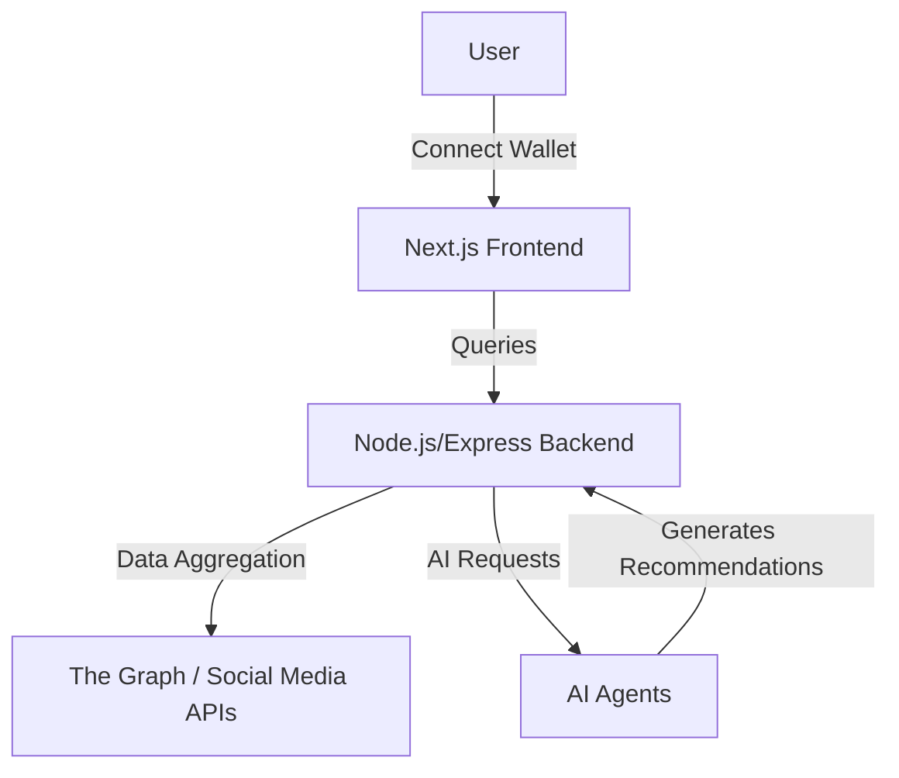
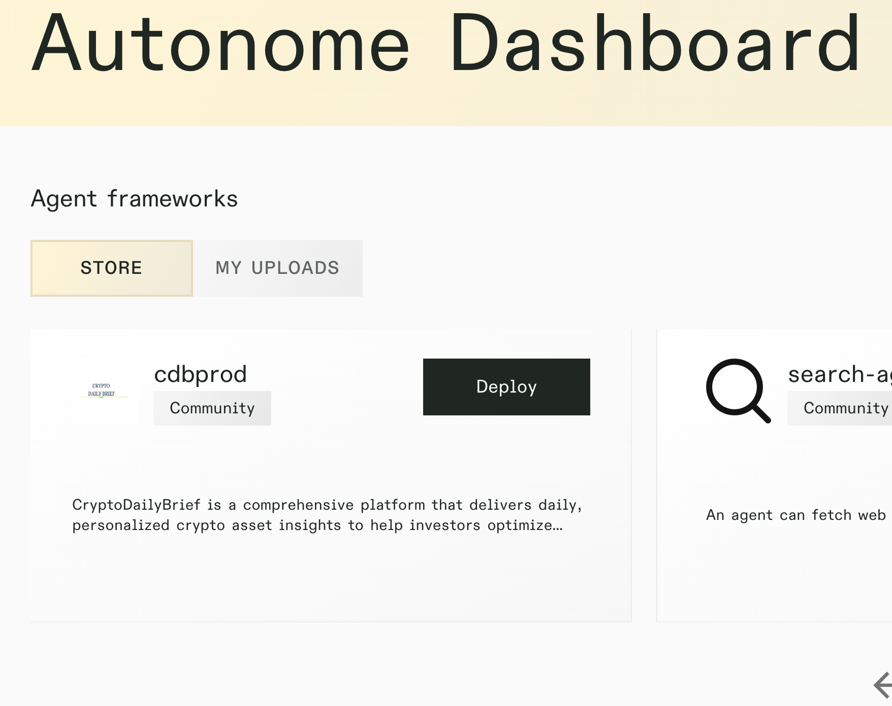
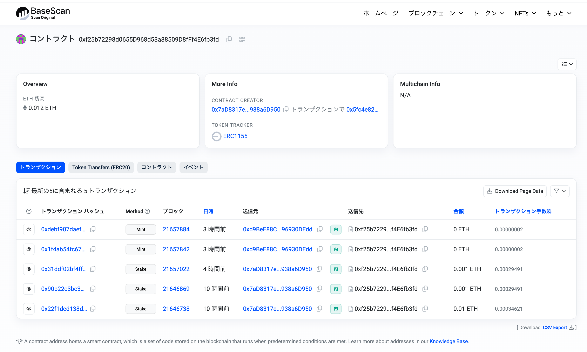
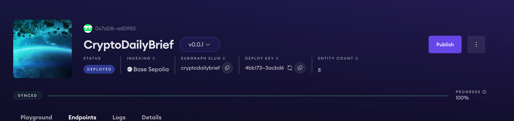

[](https://github.com/susumutomita/2025-AgenticEthereum/actions/workflows/ci.yml)

# CryptoDailyBrief – Daily Personalized Crypto Insights

ETH Global Link : https://ethglobal.com/showcase/cryptodaily-brief-uka1o

<div style="text-align: center;">
  
</div>

## Table of Contents

- [CryptoDailyBrief – Daily Personalized Crypto Insights](#cryptodailybrief--daily-personalized-crypto-insights)
  - [Table of Contents](#table-of-contents)
  - [Overview](#overview)
    - [Screenshots](#screenshots)
  - [Features](#features)
  - [Architecture \& Technologies](#architecture--technologies)
    - [Key Components](#key-components)
  - [Installation](#installation)
    - [Prerequisites](#prerequisites)
    - [Setup Steps](#setup-steps)
  - [Usage](#usage)
  - [Agent Deployment](#agent-deployment)
  - [Future Enhancements](#future-enhancements)
  - [Target Prize](#target-prize)
    - [1. Autonome](#1-autonome)
    - [2. Coinbase Developer Platform](#2-coinbase-developer-platform)
    - [3. Base](#3-base)
    - [4. The Graph](#4-the-graph)
  - [Contributing](#contributing)
  - [License](#license)
  - [Team](#team)

---

## Overview

**CryptoDailyBrief** is a comprehensive platform that provides **daily, personalized crypto asset insights** to help investors optimize portfolios, manage risks, and plan taxes. Developed as a monorepo, the project consists of four main components:

- A **frontend** built with Next.js
- A **backend** API built with Node.js/Express
- **AI agents** powered by Autonome
- **Smart contracts** developed using Foundry

The system aggregates on-chain wallet data (via The Graph) and off-chain market sentiment (via social media APIs) to generate actionable recommendations.

### Screenshots





---

## Features

- **Daily Personalized Briefing**
  Receive a tailored daily report featuring portfolio performance, risk management tips, rebalancing recommendations, and tax optimization insights.

- **Various Data Aggregation**
  - On-chain data via The Graph
  - Social media sentiment from YouTube (and more)
  - Wallet balances
  - NFT (ERC1155) tracking and analysis

- **AI-Powered Insights**
  AI agents built with Autonome analyze both historical and real-time data to propose specific actions, such as “rebalance your portfolio” or “consider tax-loss harvesting.”

- **Interactive Dashboard**
  - Responsive grid layout with draggable/resizable components
  - Real-time social media feeds
  - Dynamic transaction history
  - Portfolio analytics using Chart.js
  - Integrated Web3 wallet support

- **Smart Contract Automation**
  - ERC1155 token support
  - Automated token actions and reward issuance
  - Deployed on the Base Network

- **Enhanced Security**
  - Integrates Lit Protocol for decentralized authentication
  - Follows robust security practices via OpenZeppelin standards

---

## Architecture & Technologies

CryptoDailyBrief is designed for scalability, following a modular approach to integrate multiple microservices and third-party APIs.



### Key Components

- **Frontend (Next.js)**
  - Social media API integrations
  - Web3 wallet connection
  - Responsive grid layout
  - GraphQL integration with The Graph for transaction data

- **Backend (Node.js/Express)**
  - RESTful endpoints communicating with the AI agent (running on Autonome via Agent Kit)
  - Consolidates business logic

- **AI Agent (Autonome)**
  - Multi-chain support via wallet providers
  - The Graph protocol integration
  - ERC1155 token tracking and management
  - ERC20 token support
  - ERC721 token support
  - Managed by Agent Kit
  - Docker containerization for easy deployment

- **Smart Contracts**
  - Deployed on the Base Network
  - ERC1155-based token system

---

## Installation

### Prerequisites

- [Node.js](https://nodejs.org/) (v18 or higher)
- [Git](https://git-scm.com/)
- [Docker](https://www.docker.com/) (required if you plan to run the AI agents in containers)
- [Foundry](https://book.getfoundry.sh/) (for smart contract development)
- API keys for social media (e.g., Twitter, YouTube)

### Setup Steps

1. **Clone the Repository**
   ```bash
   git clone https://github.com/susumutomita/2025-AgenticEthereum
   cd 2025-AgenticEthereum
   ```

2. **Install Dependencies**
   ```bash
   make install
   ```

3. **Configure Environment**
   Create `.env` files in each directory:

   - **Backend `.env`**:
     ```env
     PORT=3001
     NODE_ENV=development
     ```
   - **Agent `.env`**:
     ```env
     NETWORK_ID=base-sepolia
     OPENAI_API_KEY=your_key
     CDP_API_KEY_NAME=your_key
     CDP_API_KEY_PRIVATE_KEY=your_key
     GROQ_API_KEY=your_key
     GROQ_MODEL=llama3-70b-8192
     MODE=server || chat
     API_TARGET=openai || groq || ollama
     OLLAMA_MODEL=llama3.1:latest
     OLLAMA_ENDPOINT=http://localhost:11434
     DOCKER_USERNAME=your_username
     ```
   - **Frontend `.env`**:
     ```env
     TWITTER_BEARER_TOKEN=AAAAAAAAAAAAAAAAAAAAA
     DISCORD_BOT_TOKEN=OD
     YOUTUBE_API_KEY=AIzaSyD
     ```

---

## Usage

1. **Start All Services**

   ```bash
   make dev
   ```

   Or run them individually:

   ```bash
   # Backend
   cd backend && npm run dev

   # Agent
   cd agent && npm run dev

   # Frontend
   cd frontend && npm run dev
   ```

3. **Access the Dashboard**
   Open [http://localhost:3000](http://localhost:3000) in your browser. Once you connect your Web3 wallet, you can view daily crypto briefings, portfolio analytics, and more.

---

## Agent Deployment

The agent is implemented using [Agent Kit](https://github.com/coinbase/agentkit) and runs on [Autonome](https://dev.autonome.fun/autonome). To deploy it on Autonome, you need to push your Docker image (for linux/amd64) to Docker Hub or a similar registry. Additionally, when running the agent image on Autonome, a health check endpoint is required. Autonome will send a request with the following message; make sure your application responds with a 200 status code:

```json
{
  "message": "healthz"
}
```

You also need to include a script named `/usr/local/bin/docker-entrypoint.sh` in your Dockerfile. Autonome checks for this script when launching the container.

---

## Future Enhancements

1. **Enhanced AI Models**
   - Expand coverage for more advanced rebalancing and tax scenarios.
2. **DeFi Protocol Integration**
   - Integrate lending/borrowing analytics from protocols like Aave or Compound.
3. **Mobile Application**
   - Develop native iOS/Android apps for a more convenient user experience.
4. **Advanced Tax Reporting**
   - Generate localized, comprehensive tax forms.
5. **Multi-chain Support**
   - Extend beyond Ethereum-based chains to include Solana, Avalanche, etc.

---

## Target Prize

We are aiming to qualify for prizes from the following sponsors, based on our project’s integrations and functionalities:

### 1. Autonome

- **Deployed on Autonome by cdbprod**



- **Tracks / Prizes Targeted:** Best DeFAI Agent, Best Social Agent, or Most Innovative Agent
- **Why We Qualify:**
  - Deployed our AI agent on [Autonome](https://dev.autonome.fun/) using AgentKit
  - Built a user-facing interface (Next.js) for AI-agent interaction, fulfilling the front-end requirement
  - The agent leverages on-chain data (via The Graph) to provide actionable insights, showcasing real-world impact

### 2. Coinbase Developer Platform

- **Agent kit refer to under agent folder**
- **Tracks / Prizes Targeted:** Most Innovative Use of AgentKit, Best Combination of AgentKit and OnchainKit, etc.
- **Why We Qualify:**
  - Integrated [Coinbase’s AgentKit](https://github.com/coinbase/agentkit) to give our AI agent a crypto wallet and on-chain interaction capabilities
  - Demonstrates multi-chain support for tasks like ERC1155 token issuance and NFT analytics
  - Showcases an end-to-end flow from user instruction to on-chain execution, aligning with AgentKit’s intended use cases

### 3. Base



- **Token contract address** 0xf25b72298d0655D968d53a88509D8fFf4E6fb3fd on Base sepolia [BaseScan Link](https://sepolia.basescan.org/address/0xf25b72298d0655d968d53a88509d8fff4e6fb3fd)
- **Tracks / Prizes Targeted:** Build an AI-Powered App on Base
- **Why We Qualify:**
  - Deployed our smart contracts on Base, enabling quick and cost-effective transactions
  - Provides an AI-powered portfolio management and daily insights app, illustrating the synergy of AI + L2
  - Features an accessible UI that helps mainstream users onboard easily to Base’s ecosystem

### 4. The Graph



- **Tracks / Prizes Targeted:** Best Use of The Graph with an AI Agent
- **Why We Qualify:**
  - Uses a subgraph to index on-chain wallet data and tokens
  - Our AI agent queries The Graph for historical transaction details, enabling advanced portfolio analysis
  - Demonstrates a robust GraphQL-based approach to on-chain data retrieval, integrated into AI-driven insights

By participating in these four sponsor categories, we aim to showcase how CryptoDailyBrief can combine **AI agents**, **on-chain data retrieval** (via The Graph), and **smart contract execution** (on Base) — all orchestrated by **AgentKit** from Coinbase Developer Platform and deployed on **Autonome**. Our solution not only addresses the daily needs of crypto investors but also highlights the innovative potential of multi-chain, AI-powered web3 applications.

---

## Contributing

We welcome community contributions Please follow these steps:

1. Fork this repository
2. Create a feature branch (`git checkout -b feature/your-feature`)
3. Commit your changes (`git commit -m 'Add new feature'`)
4. Push to your branch (`git push origin feature/your-feature`)
5. Create a Pull Request

---

## License

This project is licensed under the MIT License – see the [LICENSE](LICENSE) file for details.

---

## Team

- **Susumu Tomita** – Full Stack Developer
  [Personal Website](https://susumutomita.netlify.app/)
